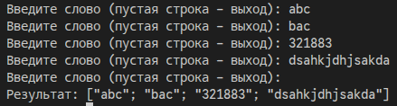
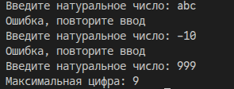
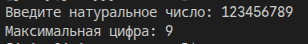
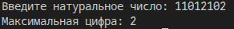
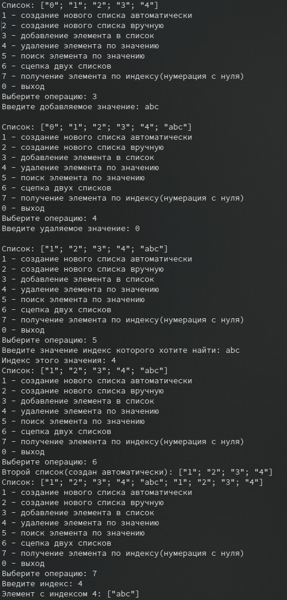
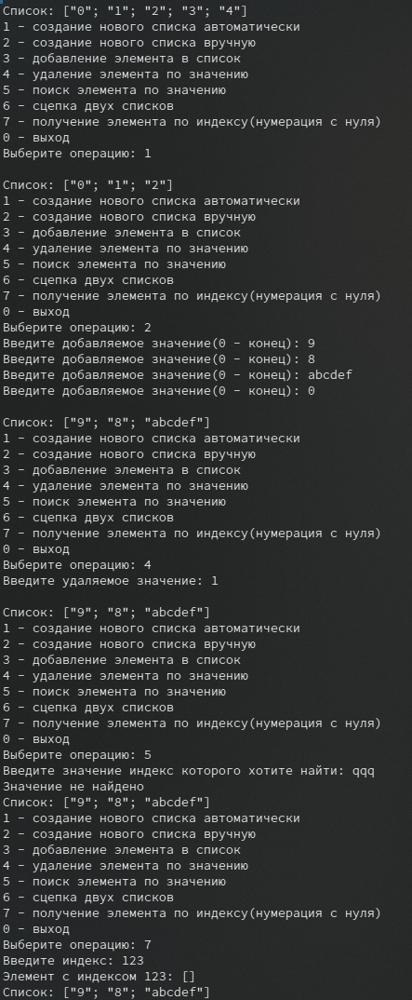

# Сурков Яков КМБ-1 Лабораторная №1

# Задание 1. Генерация списков
## Задача 4
### Текст задачи
Сформировать список из последовательно вводимых слов.

### Описание логики работы
В этой программе введенные пользователем слова складываются в один список. Программа постоянно запрашивает новое слово. Если вводить слово, оно добавится в список. Если же ничего не вводить и просто нажать Enter (ввести пустую строку), программа завершится и выведет готовый список на экран. 

### Тестирование

# Задание 2. Рекурсия
## Задача 4
### Текст задачи
Найти максимальную цифру натурального числа.

### Описание логики работы
Сначала вводится число.
Затем идет проверка правильности ввода. Если пользователь ввел буквы или отрицательное число, программа выдаст ошибку и попросит повторить ввод, пока не получит корректное натуральное число.
Сам поиск максимальной цифры работает через рекурсию. Программа постепенно берет остаток от деления на 10, получая одну цифре с конца и сравнивает ее с самой большой из тех, что уже успела найти. Когда число полностью заканчивается (равно нулю), программа выводит на экран самую большую найденную цифру.

### Тестирование

# Задание 3.
## Задача 2
### Текст задачи
Создайте собственные функции для выполнения основных операций над списками (добавление/удаление/поиск элемента, сцепка двух списков, получение элемента по номеру).

### Описание логики работы
Пользователь выбирает действие из доступных, вводя его номер. Меню работает постоянно (через рекурсию), поэтому после выполнения одного действия программа снова предлагает выбрать следующее, пока не будет введен ноль для выхода.

Все операции:
* **Создание списка:** можно заполнить его самостоятельно (вводя значения по одному, пока не введешь "0") или создать автоматически (значения от 0 до 3).
* **Добавление элемента:** новое значение просто прикрепляется в самый конец списка.
* **Удаление элемента:** программа по очереди просматривает элементы и, когда находит указанное пользователем значение, убирает его, оставляя все остальное.
* **Поиск:** программа ищет нужное значение по всему списку и сообщает его порядковый номер. Если такого значения нет, выводится ошибка.
* **Сцепка:** к текущему списку просто прикрепляется еще один дополнительный список.
* **Поиск по индексу:** пользователь вводит индекс, а программа отсчитывает элементы с начала и выдает тот, который соответствует указанному индексу. 

### Тестирование

